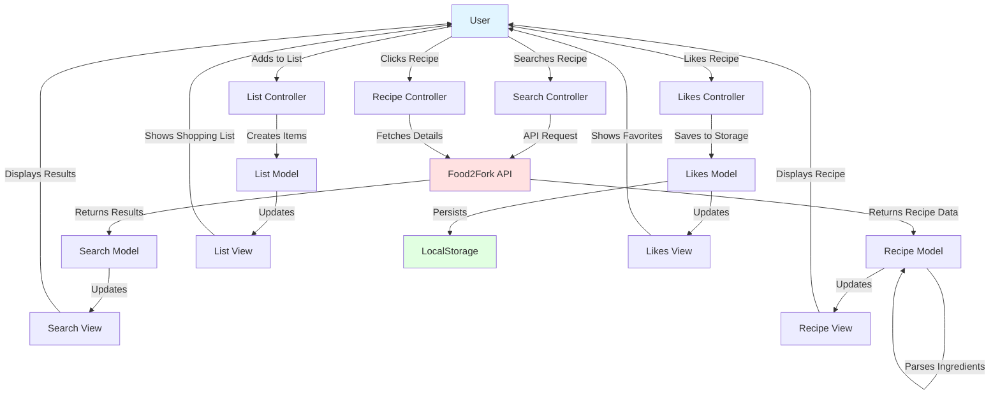
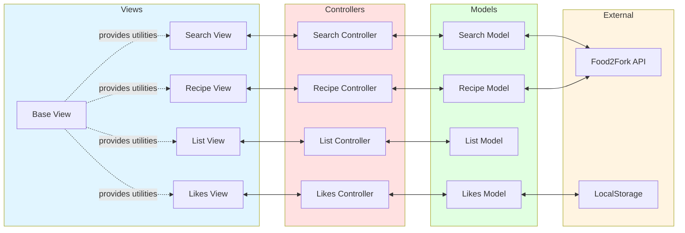

# JavaScript Learning

A comprehensive collection of JavaScript exercises and projects from "The Complete JavaScript Course 2021: From Zero to Expert!" by Jonas Schmedtmann.

Built in October 2018. This repository showcases a learning journey through modern JavaScript, from fundamentals to advanced concepts, culminating in a full-featured recipe application.

## Features

- 📚 Progressive JavaScript exercises covering fundamentals to advanced topics
- 🎮 Interactive projects: Pig Game and Budget Calculator
- 🍳 Full-featured Forkify recipe application with 1M+ recipes
- 🏗️ MVC architecture implementation
- 📦 Webpack and Babel configuration examples
- 🔄 Asynchronous JavaScript patterns
- 💾 LocalStorage implementation
- 🎨 Modern UI/UX design

## Getting Started

### Prerequisites

- Node.js (v12 or higher)
- npm (comes with Node.js)
- Modern web browser (Chrome, Firefox, Safari, or Edge)

### Installation

1. Clone the repository:
```bash
git clone https://github.com/orassayag/javascript-learning.git
cd javascript-learning
```

2. For the Forkify project (folder 11):
```bash
cd 11
npm install
npm start
```

3. For other exercises:
   - Simply open the HTML file in your browser
   - Or use a local development server (e.g., Live Server extension in VSCode)

### Configuration (Forkify Project)

For the Forkify application to work properly:

1. Obtain a free API key from [Food2Fork](http://food2fork.com)
2. Edit `11/src/js/config.js`:
   ```javascript
   export const key = 'YOUR_API_KEY_HERE';
   ```

## Project Structure

```
javascript-learning/
├── 02/            # JavaScript fundamentals (variables, operators)
├── 03/            # Advanced concepts (hoisting, scope, this)
├── 04/            # Pig Game project
├── 05/            # OOP and function constructors
├── 06/            # Budgety app (budget calculator)
├── 07/            # ES6 features (let/const, arrows, classes)
├── 10/            # Asynchronous JavaScript (promises, async/await)
└── 11/            # Forkify - Complete recipe application
    ├── src/
    │   ├── js/
    │   │   ├── index.js
    │   │   ├── models/
    │   │   └── views/
    │   ├── index.html
    │   └── css/
    ├── dist/
    └── webpack.config.js
```

## Application Flow



## Detailed Architecture (Forkify)



## Available Scripts (Forkify)

### Development
Starts webpack-dev-server with hot reloading:
```bash
npm start
```

### Build
Creates production-ready bundle:
```bash
npm run build
```

### Development Build
Creates development bundle without starting server:
```bash
npm run dev
```

## Key Features by Project

### Pig Game (Folder 04)
- Dice rolling mechanics
- Turn-based gameplay
- DOM manipulation
- Game state management

### Budgety (Folder 06)
- Income/expense tracking
- Budget calculation
- Module pattern implementation
- UI controller separation

### Forkify (Folder 11)
- Recipe search with 1M+ recipes
- Detailed recipe view with ingredients
- Shopping list management
- Favorite recipes with LocalStorage
- Serving size adjustment
- Paginated search results
- MVC architecture
- Modern JavaScript (ES6+)
- Webpack and Babel setup

## Technology Stack

- **JavaScript (ES6+)** - Modern JavaScript features
- **Webpack 4** - Module bundler
- **Babel 6** - JavaScript compiler
- **Axios** - Promise-based HTTP client
- **HTML5** - Semantic markup
- **CSS3** - Modern styling
- **LocalStorage API** - Client-side data persistence

## Learning Outcomes

This repository demonstrates proficiency in:

1. **JavaScript Fundamentals**
   - Variables, data types, and operators
   - Functions and scope
   - Objects and arrays

2. **Advanced JavaScript**
   - Prototypal inheritance
   - Closures and IIFE
   - this keyword and execution contexts
   - Hoisting

3. **ES6+ Features**
   - let and const
   - Arrow functions
   - Template literals
   - Classes
   - Modules (import/export)
   - Promises and async/await

4. **Design Patterns**
   - Module pattern
   - MVC (Model-View-Controller)
   - Observer pattern (event handling)

5. **Modern Tooling**
   - Webpack configuration
   - Babel transpilation
   - npm package management
   - Development vs production builds

6. **API Integration**
   - RESTful API consumption
   - Error handling
   - Asynchronous data fetching

## Browser Support

- Chrome (latest)
- Firefox (latest)
- Safari (latest)
- Edge (latest)

Older browsers are supported through Babel transpilation and polyfills.

## Known Issues

- Food2Fork API may have rate limiting or availability issues
- API key required for Forkify to function properly

## Contributing

Contributions to this project are [released](https://help.github.com/articles/github-terms-of-service/#6-contributions-under-repository-license) to the public under the [project's open source license](LICENSE).

Everyone is welcome to contribute. Contributing doesn't just mean submitting pull requests—there are many different ways to get involved, including answering questions and reporting issues.

Please feel free to contact me with any question, comment, pull-request, issue, or any other thing you have in mind.

## Author

* **Or Assayag** - *Initial work* - [orassayag](https://github.com/orassayag)
* Or Assayag <orassayag@gmail.com>
* GitHub: https://github.com/orassayag
* StackOverflow: https://stackoverflow.com/users/4442606/or-assayag?tab=profile
* LinkedIn: https://linkedin.com/in/orassayag

## Acknowledgments

- Jonas Schmedtmann for the excellent course content
- Food2Fork API for providing recipe data

## License

This application has an MIT license - see the [LICENSE](LICENSE) file for details.
